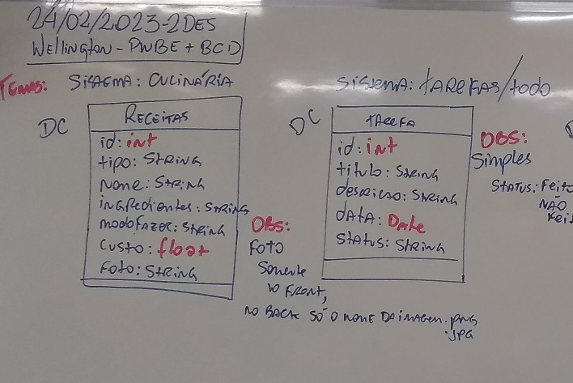
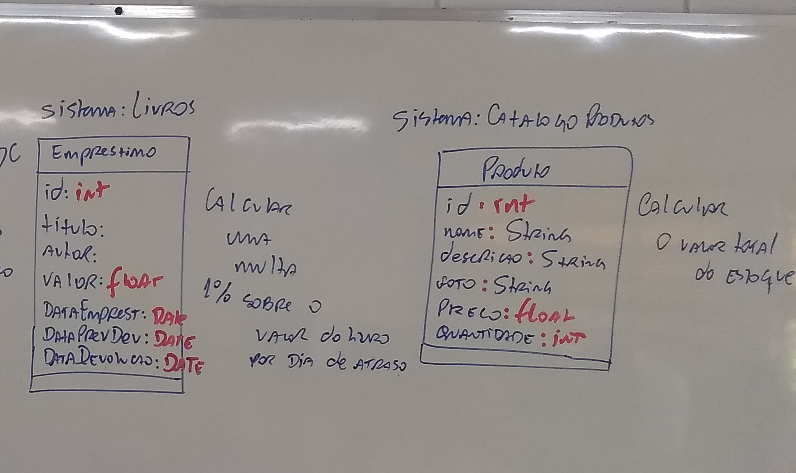

# Aula08 (Atividades)
- Seguindo o modelo do projeto full-stack **inventário**.
- Escolha um dos temas a seguir e desenvolva um projeto fullstack completo com:
    - docs
        - MER DER
        - UML DCU
        - Script SQL
    - front
        - CRUD
    - back
        - CRUD
        - MVC
        - DAO
Temas:

## Previsão de entrega para 03/03/2023